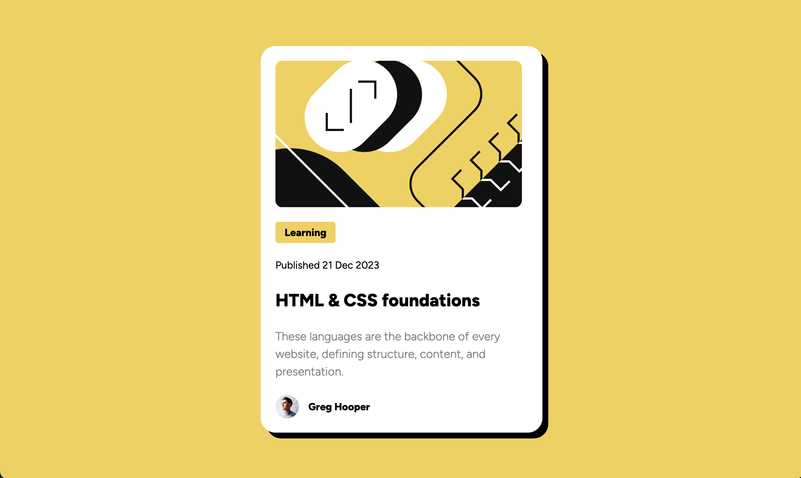

# Frontend Mentor - Blog preview card solution

## Overview

### Screenshot

### Links

-   Solution URL: [Solution](https://github.com/mhjarvis/Frontend-Projects/tree/main/Beginner/blog-preview-card)
-   Live Site URL: [Live Site](https://frontend-projects-vsbb-c2kdhfyb9-markus-projects-c0039c1f.vercel.app/)

## My process

### Built with

-   Semantic HTML5 markup
-   CSS custom properties
-   Flexbox
-   Mobile-first workflow

### What I learned

1. This was my first time using static fonts instead of importing from Google Fonts.

2. This was my first time hosting with Vercel, especially since the Netflify debaucle. I am still fairly new with using Webpack, and had some trouble originally getting images to load after uploading to Vercel. It appears that moving assets into the /dist folder has done the trick, but I'll need to dig into this further.

## Author

-   Website - Coming soon...
-   Frontend Mentor - [@mhjarvis](https://www.frontendmentor.io/profile/mhjarvis)
